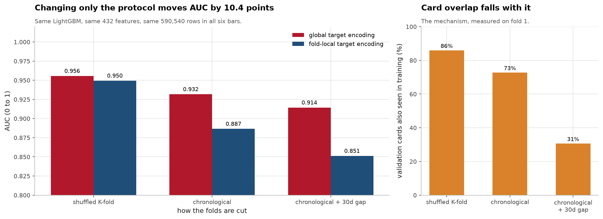
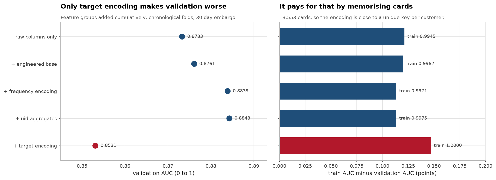
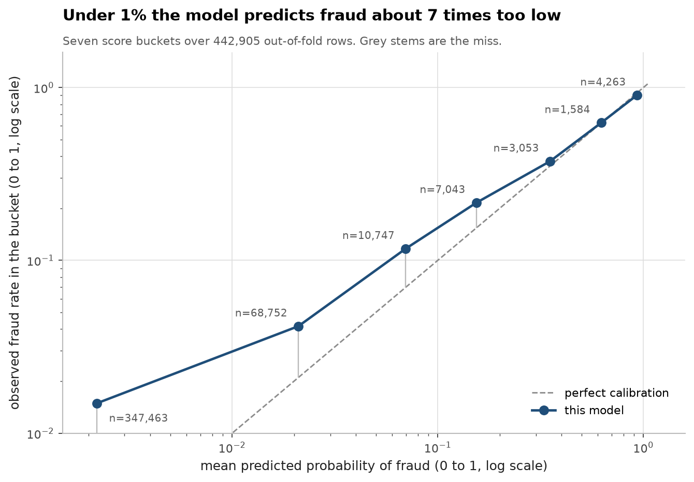
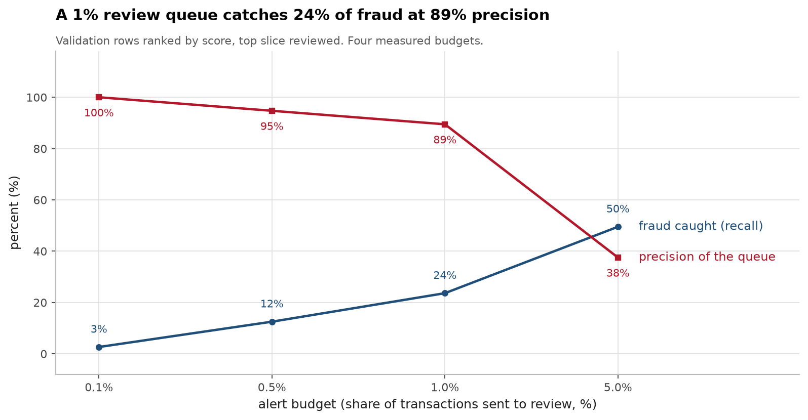
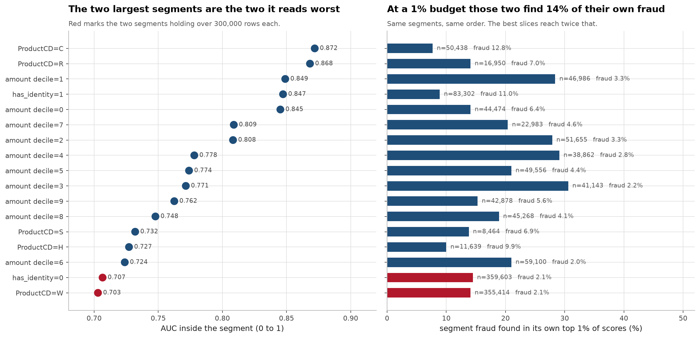

# Real-World Tabular ML, a decision trail, not a leaderboard score

**[▶ Live demo](https://ieee-fraud-ml.streamlit.app/)** · every prediction shows
the SHAP contributions behind it, and the honest validation number.

[](https://github.com/aghasalim/ieee-fraud-ml/actions/workflows/ci.yml)
[](https://github.com/aghasalim/ieee-fraud-ml/actions/workflows/demo.yml)
[](https://www.python.org/)
[](LICENSE)

Working the [IEEE-CIS Fraud Detection](https://www.kaggle.com/c/ieee-fraud-detection)
competition end to end, by a third-year Applied Computer Science (AI) student.
What I'm actually trying to produce is **[NOTES.md](NOTES.md)**: a record of
what I tried, what broke, and what I caught. A model that's slightly worse with
an honest trail behind it beats a good score with no story. Full write-up in **[notes/METHODS.md](notes/METHODS.md)**.

---

## The headline: the evaluation protocol is worth 10.4 AUC points



Model, features and rows stay fixed across those six bars; only the way the
folds are cut changes. On all 590,540 real transactions that moves AUC from
0.9557 to 0.8513. The right panel is the mechanism: card overlap between train
and validation falls from 86% to 31%.

| split | target encoding | AUC |
|---|---|---|
| shuffled K-fold | global | **0.9557** |
| shuffled K-fold | fold-local | 0.9495 |
| chronological | global | 0.9318 |
| chronological | fold-local | 0.8866 |

I submitted to the competition to check this against a scorer I can't
influence. The leakage finding held; the number I called most defensible did not:

| configuration | AUC | vs leaderboard |
|---|---|---|
| shuffled + global TE (most flattering) | 0.9557 | **+0.0471** |
| chronological + global TE | 0.9318 | +0.0232 |
| chronological + fold-local, contiguous | 0.8866 | −0.0220 |
| chronological + fold-local, 30-day embargo | 0.8513 | **−0.0573** |
| **private leaderboard (the actual answer)** | **0.9086** | - |

Expanding-window CV estimates a model trained on a fraction of the data, not
the one you ship, and the embargo removes another 30 days per fold that the
final model never pays. A pessimistic estimate is still a biased one.
Full reasoning in [notes/METHODS.md](notes/METHODS.md#1-the-headline-my-own-conclusion-was-wrong-and-i-caught-it).

## The data

590,540 × 394 transactions left-joined to 144,233 identity rows, **3.499%**
fraud, **24.4%** identity coverage, **172** columns 50 to 90% missing, 182 days
ending 30 days before the test period. Full table in
[notes/METHODS.md](notes/METHODS.md#2-what-the-data-actually-looks-like).

## The feature that backfired

| features | train AUC | val AUC | delta |
|---|---|---|---|
| raw columns only | 0.9945 | 0.8733 | - |
| + engineered base | 0.9962 | 0.8761 | +0.0028 |
| + frequency encoding | 0.9971 | **0.8839** | **+0.0078** |
| + uid aggregates | 0.9975 | 0.8843 | +0.0004 |
| + target encoding | **1.0000** | **0.8531** | **−0.0312** |

Per-entity target encoding made the model worse, and this is the correct
fold-local version with no validation labels. With 13,553 cards it is nearly a
unique key per customer, so the model memorises which customers defrauded.
Computed globally it inflates the score by 0.045 instead. Detail in
[notes/METHODS.md](notes/METHODS.md#3-the-feature-that-backfired).



## Error analysis

The two weakest segments are also the two largest, and they overlap:


| segment | n | AUC | recall@1% |
|---|---|---|---|
| **ProductCD = W** | **355,414** | **0.7030** | 0.141 |
| **no identity record** | **359,603** | **0.7066** | 0.145 |

As a review queue, which is how this would be used:

| review budget | recall | precision |
|---|---|---|
| 0.1% (442 cases) | 2.6% | **100.0%** |
| 1% (4,429) | 23.6% | 89.5% |
| 5% (22,145) | **49.5%** | 37.5% |

Calibration is fine above 25% and badly off below 1%, where it under-predicts by
nearly 7×: irrelevant for AUC, decisive for any "auto-approve under 1%" rule.
Missed-fraud profile and calibration numbers in [notes/METHODS.md](notes/METHODS.md#6-error-analysis).







## Limitations

The train to validation gap is 0.09 to 0.13 everywhere and mostly is not
fixable: it barely moves under regularisation while validation improves, which
points at temporal shift rather than capacity. The best iteration count varies
8× across folds, so no single `n_estimators` suits most of them. About 80% of
volume scores near 0.70. Pooled OOF AUC (0.7954) disagrees with mean per-fold
AUC (0.8839) because fold models are differently calibrated, so I report
per-fold. AUC rising across the validation window is confounded with later folds
having more training history.

## Running it

```bash
make setup && make validate
```

Reproduces the tables above with no Kaggle account and no credentials: it falls
back to the synthetic generator when the competition data is absent. `make test`
runs 14 tests against the real code path rather than mocks, so they'd catch the
headline claim silently breaking.

For the actual competition data you need a Kaggle token
(Settings → API → Create New API Token) and to accept the
[rules](https://www.kaggle.com/c/ieee-fraud-detection/rules):

```bash
mkdir -p ~/.kaggle && echo 'KGAT_your_token_here' > ~/.kaggle/access_token && chmod 600 ~/.kaggle/access_token
make data && make eda && make leakage-real && make train
make train-final && make app
```

```bash
make docker && docker run -p 8501:8501 ieee-fraud-ml
```

Scope checklist and deployment notes are in
[notes/METHODS.md](notes/METHODS.md#10-deploy).

## Repository layout

```
src/fraud/
  config.py                      experiment knobs in one place
  data.py                        download, join identity, downcast dtypes
  split.py                       the load-bearing file, chronological CV,
                                 entity overlap, embargo gap
  experiments/validation_gap.py  the 2×2 on synthetic data
  experiments/leakage_real.py    the 2×2 on 590k real transactions
tests/                           14 tests, synthetic data only
notes/METHODS.md                 the long-form methods write-up
NOTES.md                         the decision trail
```

## References

The papers and sources this implementation follows. Each one is here because
the code uses the method, the dataset or the metric it describes.

- **Ke, Meng, Finley et al. LightGBM: A Highly Efficient Gradient Boosting Decision Tree. NeurIPS 2017.** the model.
- **Lundberg, Lee. A Unified Approach to Interpreting Model Predictions. NeurIPS 2017.** [arXiv:1705.07874](https://arxiv.org/abs/1705.07874) SHAP, used for the decision trail.
- **Niculescu-Mizil, Caruana. Predicting Good Probabilities With Supervised Learning. ICML 2005.** probability calibration.

## Author and licence

Aghasalim Mustafazada. MIT, see [LICENSE](LICENSE). The competition data is not
redistributed here;`make data` fetches it from Kaggle under their terms.
