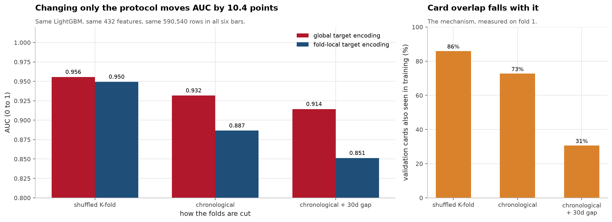
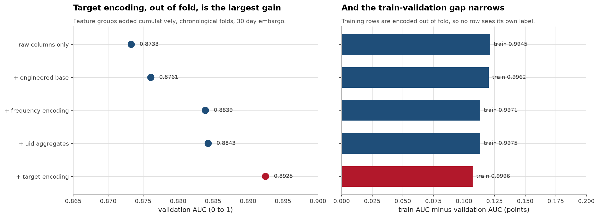
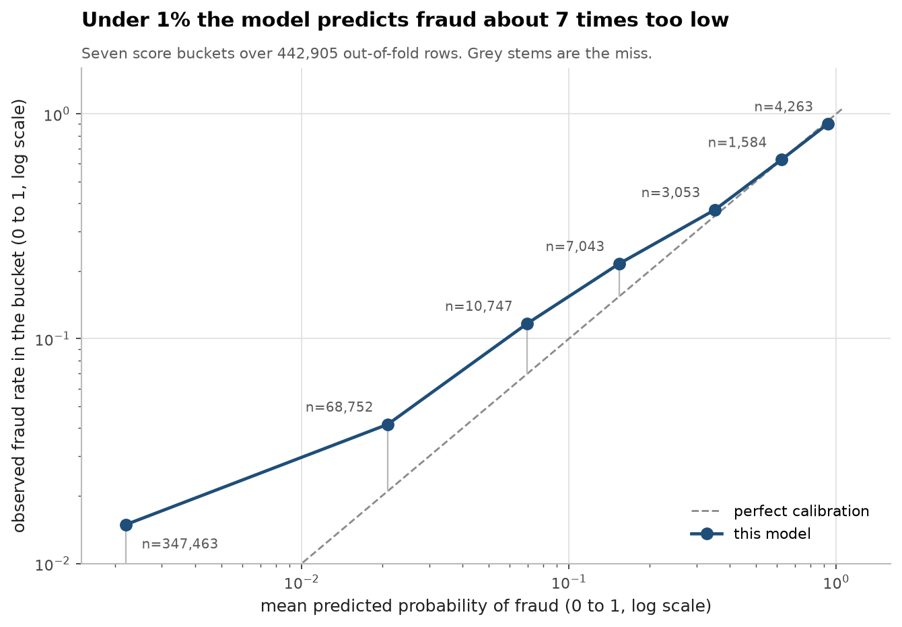
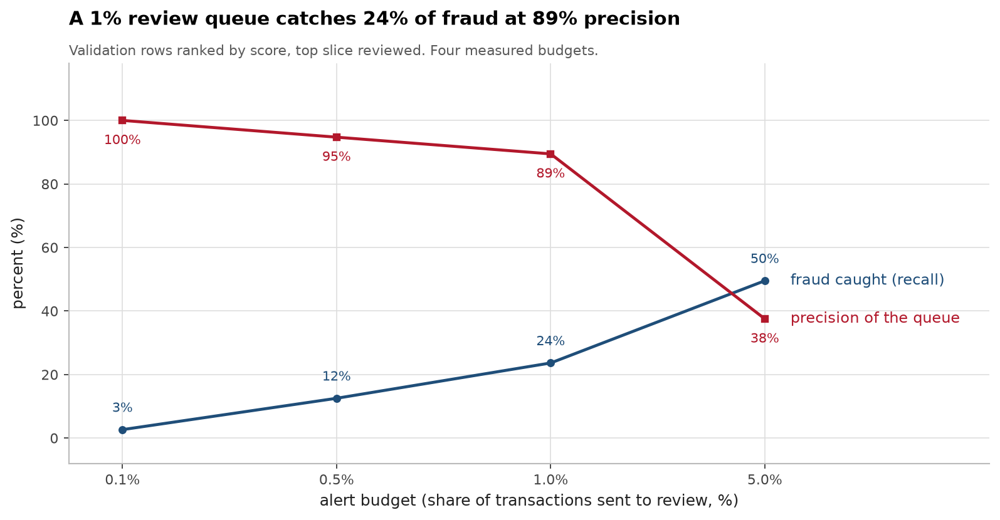
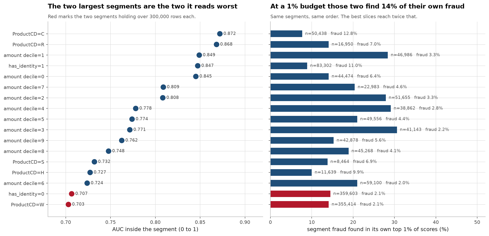

# Real-World Tabular ML, a decision trail, not a leaderboard score

**[▶ Live demo](https://ieee-fraud-ml.streamlit.app/)** · each prediction comes
with its SHAP contributions and the leak-free validation number.

[](https://github.com/aghasalim/ieee-fraud-ml/actions/workflows/ci.yml)
[](https://github.com/aghasalim/ieee-fraud-ml/actions/workflows/demo.yml)
[](https://www.python.org/)
[](LICENSE)
[](https://doi.org/10.5281/zenodo.23003651)

I worked through the [IEEE-CIS Fraud Detection](https://www.kaggle.com/c/ieee-fraud-detection)
competition end to end.
The thing I really wanted out of it is [NOTES.md](NOTES.md). It's a log of
what I tried, the things that broke and the mistakes I caught. I'd rather have a
slightly worse model I can explain step by step than a good score with no story
behind it. Every number in here is recomputed from the raw scores by the
independent implementations in `verify/`, and the build fails if they don't
agree. The full write-up is in [notes/METHODS.md](notes/METHODS.md).

---

## The headline: the evaluation protocol is worth 10.4 AUC points



The model, features and rows stay the same across those six bars. The only
thing I change is how the folds are cut. I ran it on all 590,540 real
transactions, and AUC drops from 0.9557 to 0.8513. The right panel shows why.
Card overlap between train and validation falls from 86% to 31%.

| split | target encoding | AUC |
|---|---|---|
| shuffled K-fold | global | **0.9557** |
| shuffled K-fold | fold-local | 0.9495 |
| chronological | global | 0.9318 |
| chronological | fold-local | 0.8866 |

I submitted to the competition so I could check this against a scorer I can't
influence. The leakage finding held up. The number I'd called the most
defensible didn't.

| configuration | AUC | vs leaderboard |
|---|---|---|
| shuffled + global TE (most flattering) | 0.9557 | **+0.0471** |
| chronological + global TE | 0.9318 | +0.0232 |
| chronological + fold-local, contiguous | 0.8866 | −0.0220 |
| chronological + fold-local, 30-day embargo | 0.8513 | **−0.0573** |
| **private leaderboard (the actual answer)** | **0.9086** | - |

Expanding-window CV scores a model trained on a fraction of the data, and
that isn't the model you ship. The embargo also removes another 30 days per
fold, which the final model never pays for. So a pessimistic estimate is still
a biased one. I wrote out the full reasoning in [notes/METHODS.md](notes/METHODS.md#1-the-headline-my-own-conclusion-was-wrong-and-i-caught-it).

## The data

The transaction table is 590,540 × 394. I left-joined it to 144,233 identity
rows. Fraud is 3.499% of transactions, and identity coverage is only 24.4%.
There are 172 columns that are 50 to 90% missing. The data covers 182 days and
ends 30 days before the test period. The worst single column, `dist2`, is
93.6% missing. Fraud isn't spread evenly across product codes. It's 11.7% on C
and 2.0% on W, a 5.7x spread.
W is also the largest code at 439,670 rows.
The full table is in
[notes/METHODS.md](notes/METHODS.md#2-what-the-data-actually-looks-like).

## The feature that looked like it backfired

| features | train AUC | val AUC | delta |
|---|---|---|---|
| raw columns only | 0.9945 | 0.8733 | - |
| + engineered base | 0.9962 | 0.8761 | +0.0028 |
| + frequency encoding | 0.9971 | 0.8839 | +0.0078 |
| + uid aggregates | 0.9975 | 0.8843 | +0.0004 |
| + target encoding | 0.9996 | **0.8925** | **+0.0082** |

At first I reported that target encoding cost 0.0312 AUC, with train AUC at
1.0000. I blamed the model for memorising customers. The real cause was my
encoder. It kept the validation labels out, but it encoded every training row
with a category mean that included that row's own label. Card and uid keys are
close to unique, so that mean is the label. Once I encoded the
training rows out of fold, the same feature became the best group in the table
at +0.0082. Computed globally, it still inflates the score by 0.045. The
shipped model predates this fix and doesn't use it. There's more detail in
[notes/METHODS.md](notes/METHODS.md#3-the-feature-that-looked-like-it-backfired).



## Error analysis

The two weakest segments are also the two largest. They overlap, too.


| segment | n | AUC | recall@1% |
|---|---|---|---|
| **ProductCD = W** | **355,414** | **0.7030** | 0.141 |
| **no identity record** | **359,603** | **0.7066** | 0.145 |

Here's how it does as a review queue, since that's how it would really be used.

| review budget | recall | precision |
|---|---|---|
| 0.1% (442 cases) | 2.6% | **100.0%** |
| 1% (4,429) | 23.6% | 89.5% |
| 5% (22,145) | **49.5%** | 37.5% |

Calibration is fine above 25%. Below 1% it's badly off, and it under-predicts
by nearly 7×. That doesn't matter for AUC. It matters a lot for any
"auto-approve under 1%" rule. I put the missed-fraud profile and the
calibration numbers in [notes/METHODS.md](notes/METHODS.md#6-error-analysis).







## Limitations

The train to validation gap is 0.09 to 0.13 everywhere, and I can't fix most
of it. It barely moves under regularisation while validation improves. To me
that points at temporal shift, and I don't think capacity is the problem. The
best iteration count varies 8× across folds, so no single `n_estimators` suits
most of them. About 80% of volume scores near 0.70. Pooled OOF AUC (0.7954)
disagrees with mean per-fold AUC (0.8839) because the fold models are
calibrated differently. That's why I report per-fold. AUC does rise across the
validation window, but that's confounded with later folds having more training
history.

## Running it

```bash
make setup && make validate
```

If the competition data isn't there, this runs the same 2x2 on synthetic
data. You don't need a Kaggle account or any credentials for it. It reproduces
the finding. It won't reproduce the table. On synthetic rows the shuffled cells
read 0.8975 and 0.6779. The chronological ones read 0.8889 and 0.6166. That's
an inflation of 0.28 AUC, against 0.07 on the real data. The numbers in the
table above come from the real 590k transactions. Those need the token, and
`make leakage-real` runs them. `make test` runs 14 tests against the real code
path with no mocks. They'd catch it if the headline claim ever broke silently.

To use the real competition data you need a Kaggle token
(Settings → API → Create New API Token). You also have to accept the
[rules](https://www.kaggle.com/c/ieee-fraud-detection/rules).

```bash
mkdir -p ~/.kaggle && echo 'KGAT_your_token_here' > ~/.kaggle/access_token && chmod 600 ~/.kaggle/access_token
make data && make eda && make leakage-real && make train
make train-final && make app
```

```bash
make docker && docker run -p 8501:8501 ieee-fraud-ml
```

The scope checklist and deployment notes are in
[notes/METHODS.md](notes/METHODS.md#10-deploy).

## Repository layout

```
src/fraud/
  config.py                      experiment knobs in one place
  data.py                        download, join identity, downcast dtypes
  split.py                       the load-bearing file, chronological CV,
                                 entity overlap, embargo gap
  experiments/validation_gap.py  the 2×2 on synthetic data
  experiments/leakage_real.py    the 2×2 on 590k real transactions
tests/                           14 tests, synthetic data only
verify/                          cross-language recomputation of every figure
notes/METHODS.md                 the long-form methods write-up
NOTES.md                         the decision trail
```

## References

What I read to build this, and what each one gave me.

- **Ke, Meng, Finley et al. LightGBM: A Highly Efficient Gradient Boosting Decision Tree. NeurIPS 2017.** the model.
- **Lundberg, Lee. A Unified Approach to Interpreting Model Predictions. NeurIPS 2017.** [arXiv:1705.07874](https://arxiv.org/abs/1705.07874) SHAP, used for the decision trail.
- **Niculescu-Mizil, Caruana. Predicting Good Probabilities With Supervised Learning. ICML 2005.** probability calibration.

## Author and licence

Aghasalim Mustafazada. MIT, see [LICENSE](LICENSE). The competition data isn't
redistributed here. `make data` fetches it from Kaggle under their terms.
